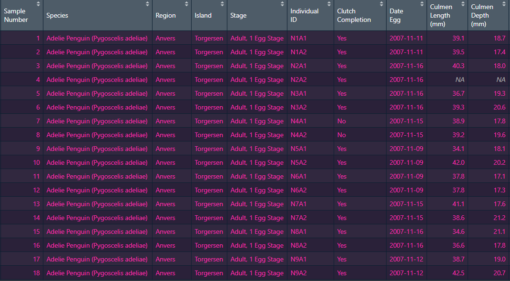

```{r setup, include=FALSE}
options(htmltools.dir.version = FALSE)
knitr::opts_chunk$set(
  fig.width=9, fig.height=3.5, fig.retina=3,
  out.width = "100%",
  cache = FALSE,
  echo = TRUE,
  message = FALSE, 
  warning = FALSE,
  hiline = TRUE
)
```

```{r xaringan-themer, include=FALSE, warning=FALSE}
library(xaringanthemer)
library(tidyverse)
style_mono_dark(
  text_color = "#FFFAF0",
  header_color = "#8FBC8F",
  background_color = "#181818",
  link_color = "#FF69B4",
  # code_font_family = "Fira Code",
  # code_font_url = "https://cdn.jsdelivr.net/gh/tonsky/FiraCode@2/distr/fira_code.css"
)
```

# Introduction

.pull-left[

]

.pull-right[`Dplyr` est un package de l'univers Tidyverse qui a pour but de faciliter la manipulation de données. <br><br> `Dplyr` est fortement inspiré du package `plyr`, mais vient régler des problèmes de lenteur des programmes, en permettant de travailler avec des données contenues dans des bases de données externes.
]


---
class: center

# Importation des données 

--
Pour démontrer les fonctions de Dplyr, nous allons utilisé les données brutes 
de [palmerpenguins](https://allisonhorst.github.io/palmerpenguins/reference/penguins_raw.html#format)

.pull-left[
```{r}
library(palmerpenguins)
data_penguin = (penguins_raw)

```

]
--
.pull-right[

]

---
class: inverse center middle

#  🐧 Les Fonctions de Dplyr 🐧

---
class: center, middle

### Regrouper

--

### Sommaire 

--

### Manipuler 

--

### Fonctions vectorielles

--

### Joindre des tableaux


---

# Regrouper

.pull-left[
### group_by()
```{r}
species <- data_penguin %>% group_by(Species) 
species %>% summarize(body = mean(!is.na(`Body Mass (g)`)))

```
]

--

<!-- .pull-left[ -->
<!-- ### rowwise() -->


<!-- ] -->

<!-- -- -->

<!-- .pull-right[ -->
<!-- ### ungroup() -->


<!-- ] -->
---

# Sommaire

---

# Manipuler


---


# Fonctions vectorielles

---


# Joindre des tableaux


---

class: center, middle

# MERCI :) 

[**xaringan**](https://github.com/yihui/xaringan)<br>
[gadenbuie/xaringanthemer](https://github.com/gadenbuie/xaringanthemer)


