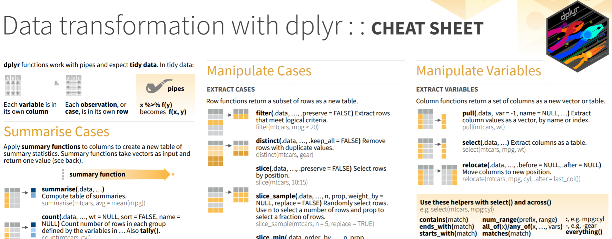
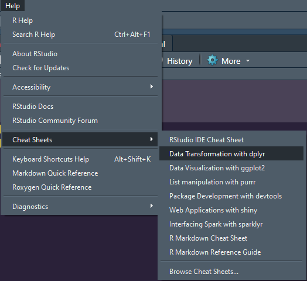
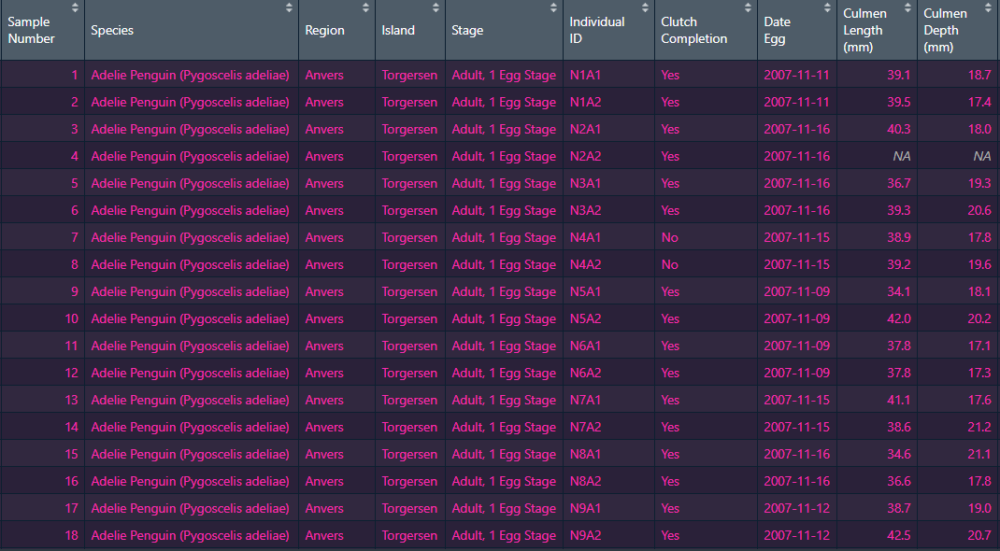
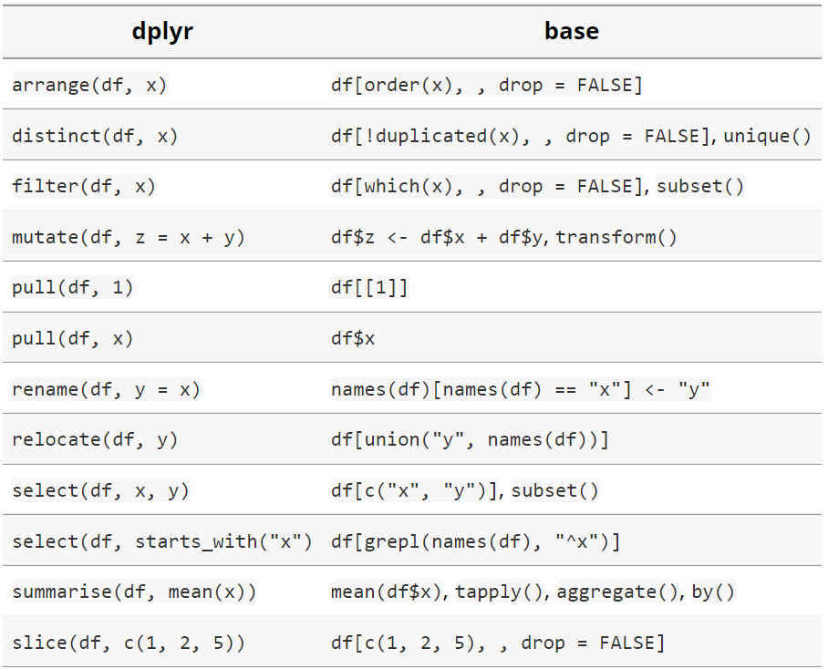

```{r setup, include=FALSE}
options(htmltools.dir.version = FALSE)
source("functions.R", local = knitr::knit_global())
knitr::opts_chunk$set(
  fig.width=9, fig.height=3.5, fig.retina=3,
  out.width = "100%",
  cache = FALSE,
  echo = TRUE,
  message = FALSE, 
  warning = FALSE,
  hiline = TRUE
)
```

```{r xaringan-themer, include=FALSE, warning=FALSE}
library(xaringanthemer)
library(tidyverse)
library(kableExtra)
library(magrittr)
style_mono_dark(
  text_color = "#F5F5F5",
  header_color = "#8FBC8F",
  background_color = "#181818",
  link_color = "#FF69B4",
  # code_font_family = "Fira Code",
  # code_font_url = "https://cdn.jsdelivr.net/gh/tonsky/FiraCode@2/distr/fira_code.css"
)
```

# Introduction

.pull-left[

]

.pull-right[`Dplyr` est un package de l'univers Tidyverse qui a pour but de faciliter la manipulation de données. <br><br> `Dplyr` est fortement inspiré du package `plyr`, mais vient régler des problèmes de lenteur des programmes, entre autres en permettant de travailler avec des données contenues dans des bases de données externes.
]
---
## *Cheat Sheet*

Les différentes fonctions et possibilités avec Dplyr sont réunies dans **Data transformation with dplyr : : CHEAT SHEET**  

---
## *Cheat Sheet*

.pull-left[

]
.pull-right[
### Sur github.com/CynthiaBH : 

[data-transformation.pdf](data-transformation.pdf)
]
---
class: center

# Importation des données 

--
Pour démontrer les fonctions de Dplyr, nous allons utilisé les données brutes 
de [palmerpenguins](https://allisonhorst.github.io/palmerpenguins/reference/penguins_raw.html#format)

.pull-left[
```{r}
library(palmerpenguins)
data_penguin = (penguins_raw)
data_penguin_tidy = (penguins)

```

]
--
.pull-right[

]

---
class: inverse center middle

#  🐧 Les Fonctions de Dplyr 🐧

---
class: center, middle

### Manipulation 
--

### Sommaire 
--

### Regrouper 
--

### Joindre des *dataframes*  

---
## Petites notes: 
À certains endroits, je vais utiliser:
- `%<>%` emprunté à *Magrittr* pour écrire `dataframe %<>% fonction`  au lieu de `dataframe <- dataframe %>% fonction`

---
## Avant de commencer...
.pull-left[
Il y a certaines valeurs **N/A** parmi les variables numériques: 
- `Culmen Length (mm)`
- `Culmen Depth (mm)`
- `Flipper Length (mm)`
- `Body Mass (g)` 

... qu'on aimerait "éliminer" pour faire certains calculs.

]
.pull-right[

]

Nous voulons quand même garder une version des données brutes, alors nous allons créer un autre *dataframe* pour nos calculs (moyenne par exemple) de la section **Sommaire**:  

<center>`data_calcs`

---
class: inverse center middle
#  🐧 Manipulation 🐧

---

# Manipulation
<center>
<div class="caption">Source: https://cran.r-project.org</div>


---
# Manipulation
### filter()  
--


```{r}
 data_calcs <- data_penguin %>%
     filter(across(c(10:13), ~ !is.na(.x)))
```
> *10:13 = les positions des colonnes : `Culmen Length (mm)`, `Culmen Depth (mm)`, `Flipper Length (mm)` et `Body Mass (g)`.*  

--

<center>On vérifie si les rangées contenant des **NA** dans les colonnes choisies ci-haut, ont bel et bien été filtrées. 
.pull-left[
```{r}
data_penguin %>% count()
```
] 
.pull-right[
```{r}
data_calcs %>% count()
```
]  

Ceci va nous éviter de spécifier **`!is.na`** ou **`na.rm = TRUE`** à chaque fois.


---

> Si on veut vraiment vérifier s'il n'y a pas de valeur **NA** restantes dans nos 4 colonnes, on peut utiliser une autre fonction de `dplyr`  

--

### select()

```{r}
data_calcs %>%  select(10:13) %>% summarise_all(list(~sum(is.na(.))))
```

--

<u>En Base R</u>
```{r}
which(is.na(data_calcs[10:13]))
```
---

# Manipulation

<u>**Objectif**</u> : "Nettoyer" nos données brutes pour arriver aux données *tidy* disponibles sur le site de [palmerpenguins](https://allisonhorst.github.io/palmerpenguins/reference/penguins_raw.html#format)


```{r}
kable(head(data_penguin), caption = "Données Brutes") %>%
    kable_styling(full_width = F, font_size = 10)

```  

---
class: center, middle
```{r}
kable(head(data_penguin_tidy), caption = "Données Tidy") %>%
    kable_styling(full_width = F, font_size = 20)

```

---

### <u>Éléments à modifier</u>
1. <u>Enlever des colonnes:</u> 
  - `studyName, Sample Number, Region, Stage, Individual ID, Clutch Completion, Delta 15 N, Delta 13 C, Comments`
1. <u>Changer le nom des colonnes:</u>
  - `Date Egg`  devient `year` 
  - `Culmen lenght (mm)`  devient `bill_lenght_mm` 
  - `Culmen depth (mm)`  devient `bill_depth_mm` 
  - `Flipper lenght (mm)`  devient `flipper_lenght_mm` 
  - `Body Mass (g)`  devient `body_mass_g` 
1. Extraire année de la variable `Date Egg` qui devient `year`
1. Déplacer colonne `year`  

> <center>*Le résultat des modifications à `data_penguin` (données brutes) sera sauvegardé dans `data_penguin_clean` dans la prochaine section.* 


---
## 1. Exercice: Enlever des colonnes

### select()
> **syntaxe:** select(df, colonne.s) <u>*ou*</u> df %>% select(colonne.s)  

✏️Essayez !  
--

<u>Une réponse possible:</u>
```{r}
#Sélectionner que les colonnes qui restent
data_penguin_clean <- data_penguin %>% select(c(3,5,9:14))
```
```{r echo=FALSE}
show_head(data_penguin_clean)
```

---
<u>Autre réponse possible:</u>
```{r}
# Sélectionner les colonnes à enlever
data_penguin_clean <- data_penguin %>% select(-c(1,2,4,6:8,15:17))
```
--

On pourrait lister les colonnes par nom également  
--

... et sûrement plusieurs autres possibilités
--

### Autres caractéristiques de sélection pour select()
- everything()
- last_col()
- starts_with()
- ends_with()
- contains()
- matches()
- num_range()
- where()

Il y a aussi: `select_if, select_all, select_at`
---
## 2. Exercice: Changer le nom des colonnes

### rename()
> **syntaxe:** rename(df, nouv_nom = ancien_nom) <u>*ou*</u> df %>% rename(nouv_nom = ancien_nom) 

✏️Essayez !  
--

<u>Une réponse possible:</u>
```{r}
data_penguin_clean %<>% rename(
    bill_lenght_mm = `Culmen Length (mm)`,
    bill_depth_mm = `Culmen Depth (mm)`,
    flipper_lenght_mm = `Flipper Length (mm)`,
    body_mass_g = 7 #On peut aussi indiquer l'indice de la colonne
    ) 
```

---
### rename()

Les noms des variables *tidy* sont toutes en minuscules, alors changeons cela également.
```{r}
data_penguin_clean %<>% rename_all(tolower)
```
Regardons le résultat:
--

```{r echo=FALSE}
show_head(data_penguin_clean)
```  
--  

Comme `select()`, il y a aussi: `rename_if, rename_all, rename_at`
---
## 3. Exercice: Extraire année de la variable *date egg*
Pour obtenir une colonne `year` avec l'année de la colonne `date egg`, on pourrait extraire l'année seulement puis la placer dans une nouvelle colonne à la fin du *dataframe* grâce à ...
--

### mutate() ou transmute()
> **syntaxe:** mutate(df, nouvelle_colonne)  <u>*ou*</u>  df %>% mutate(nouvelle_colonne)

✏️Essayez !  
--

<u>Une réponse possible:</u>
```{r}
dt <- data_penguin_clean %>% mutate(year = format(`date egg`, format="%Y"))
dt %<>% select(-3) #enlever l'ancienne colonne `date egg`
```
```{r echo=FALSE}
 show_head(dt)
```

---
## 3. Exercice: Extraire année de la variable *Date Egg* (suite)

On aurait pu aussi, ne garder que l'année dans la colonne `date egg`, changer le nom de la colonne, puis la déplacer en dernière position du *dataframe* grâce à ... 

--

### relocate()
> relocate(df, ..., .before = NULL, .after = NULL) *par défaut va placer la colonne en premier*

```{r}
data_penguin_clean$`date egg` <- format(data_penguin_clean$`date egg`, format="%Y")
data_penguin_clean %<>% rename(year = `date egg`) %>% relocate(year, .after = last_col()) 
```
--

```{r echo=FALSE}
show_head(data_penguin_clean)
```
---
# Dernière étape...
### pull()
.pull-left[
```{r}
dt <- data_penguin_clean %>% pull(species)
```
```{r echo=FALSE}
show_head(dt)
```
]
.pull-right[
```{r}
dt <- data_penguin_tidy %>% pull(species)
```
```{r echo=FALSE}
show_head(dt)
```
]  

<br><center>...pour que nos données soient identiques à celles *tidy*.

---
 

---
class: inverse center middle
#  🐧 Sommaire 🐧

---

# Sommaire
### summarise():
> summarise(.data, ..., .groups = NULL )

```{r}
data_calcs %>% summarise(mean_mass = mean(`Body Mass (g)`)) 
data_calcs %>% summarise(med_flipper = median(`Flipper Length (mm)`)) 
```

--

<u>Autres fonctions qui peuvent être utilisées avec `summarise()`:</u>  
`sd(), IQR(), mad(),min(), max(), quantile(),first(), last(), nth(),n(), n_distinct(),any(), all()`

---
# Sommaire

.pull-left[
<u>`summarise()`</u>: 

```{r}
data_calcs %>% summarise(mean_mass = mean(`Body Mass (g)`))  
data_calcs %>% summarise(med_flipper = median(`Flipper Length (mm)`)) 

```
]
.pull-right[
<u>Base R</u> : 
```{r}
mean(data_calcs$`Body Mass (g)`)  
median(data_calcs$`Flipper Length (mm)`) 
```
]
---
# Sommaire

.pull-left[
<u>`dplyr::summarise()`</u>: 

```{r}
data_calcs %>% summarise(
  mean_mass = mean(`Body Mass (g)`), 
  med_flipper = median(`Flipper Length (mm)`), 
  max_culmen = max(`Culmen Length (mm)`))  
```
]
.pull-right[
<u>Base R</u> : 
```{r}
mean(data_calcs$`Body Mass (g)`)  
median(data_calcs$`Flipper Length (mm)`) 
max(data_calcs$`Culmen Length (mm)`) 
```
]
---
# Sommaire
#### autres variantes de summarise():
> `summarise_if()`

```{r}
dt <- data_calcs %>% group_by(Species) %>% summarise_if(is.numeric, list(maximum = max))
```
```{r echo=FALSE}
show_table_sm(dt) 
```

Il y a aussi `summarise_at` et `summarise_all`

---

class: inverse center middle

#  🐧 Regrouper 🐧

---
# Regrouper

### group_by() & ungroup()
> `group_by(.data, ..., .add = FALSE, .drop = TRUE)`   
> `ungroup(x, ...)`

--

```{r}
dt <- data_penguin %>% group_by(Species) %>% summarize(Totals = n()) 
```
```{r echo=FALSE}
show_table(dt)
```

---
  
```{r}
dt <- data_calcs %>% group_by(Sex) %>% summarize(mean_mass = mean(`Body Mass (g)`)) 
```
```{r echo=FALSE}
dt <- arrondir(dt, "mean_mass", 0)
show_table(dt)  
```  

--

```{r}
dt <- data_calcs %>% group_by(Region, Island) %>% summarize(mean_mass = mean(`Body Mass (g)`)) 
``` 

```{r echo=FALSE}
dt <- arrondir(dt, "mean_mass", 0)
show_table(dt)
```  

---
class: center, middle

```{r}
dt <- data_calcs %>% group_by(Species,Region, Island, Sex) %>% summarize(mean_mass = mean(`Body Mass (g)`))

```  

--

```{r echo=FALSE}
dt <- arrondir(dt,"mean_mass", 0)
show_table(dt)
```

---
# Regrouper
### rowwise()
> `rowwise(.data, ...)`

---

class: inverse center middle

#  🐧 Joindre des *dataframes* 🐧

---

# Joindre des *dataframes* 


---
class: center, middle

# MERCI :) 

[**xaringan**](https://github.com/yihui/xaringan)

---
## Ressources:

- [Cran R-project/Dplyr](https://cran.r-project.org/web/packages/dplyr/vignettes/base.html)
- [R for Data Science](https://r4ds.had.co.nz/transform.html)
- [Data Carpentry](https://datacarpentry.org/R-genomics/04-dplyr.html)
- [Tidyverse/Dplyr](https://dplyr.tidyverse.org/index.html)


